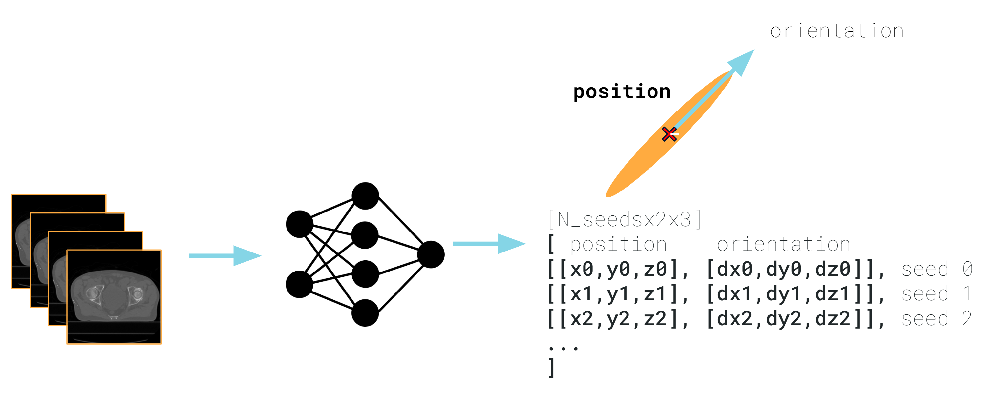
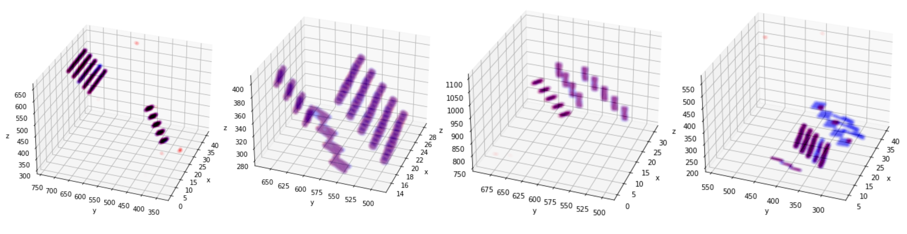
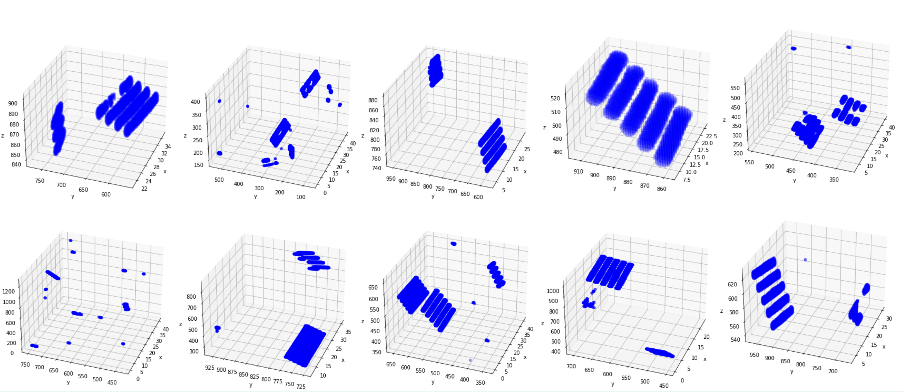
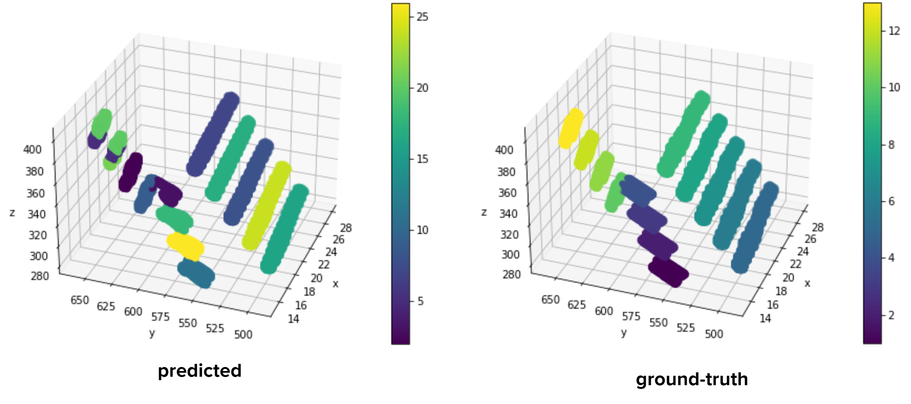

# McMedHacks Grand Challenge
The winner project for AlphaTau Grand Challenge in McMedHacks (https://mcmedhacks.com/hackathon/).

In this project, inspired by some successful approaches in Statistical Machine Learning, Deep learning and Computer Vision, we designed a multi-stage pipeline to solve the problem of Seed detection in CT images.

The proposed design flow

## Our Approach
* Perform Semantic Segmentation on the 3D Image
  * Treating the Mask as a boolean Matrix and using it as Ground Truth
* Use the Semantic Mapping to find the number of seeds
  * Taking the output of the previous step and use an a NN to find the number of seeds
* Cluster the given points using Gaussian Mixture Models
  * Take the output of semantic segmentation and cluster it using the number of seeds
* Find the seed positions and orientation from the clusters

## How we built it
1. This step involves using a 2D U-Net pre-trained for semantic segmentation an MRI dataset. Since our data is 3d, the model cannot be used in a naive way. For each layer of the output matrix, a seperate U-net is called with the correspoding layer in input and its sorrounding two layers used as inputs. We use each as seperate channels in the 2D U-Net. This basically turns each data sample into several (usually 41) new data samples which are all used to fine-tune the U-Net.

2. This step involves counting the number of seeds given the Mask matrix. This mask matrix only has ones and zeros as its elements. Our first approach for solving this step involves using a Multi-layer neural network composed of 3D Convolution layers, 3D Batch Normalization layers, Relu activation function and Linear layers. This neural network is trained to correctly predict the number of seeds. Due to some complications, this component does not work as planned. Another approach was used which is discussed in the next section.

3. At this step, it is assumed we have 3D mask matrix and the number of seeds. Using this data we can use clustering methods to find the seeds. Gaussian Mixture Models are used to cluster the ones in the 3D mask matrix. It was mentioned that the Neural Network used at the previous step might not be as accurate for finding the number of seeds. Another clustering method is Bayesian Gaussian Mixture models which involves using Bayesian optimization to find the best Mixture of Gaussians. An advantage of this method is that it also finds the number of clusters that is most optimal.

4. The final step involves finding the seed location and orientation. We find these attributes by taking a look at the mixture of Gaussian we made at the previous step. The mean of each Gaussian distribution is used as the Seed location. We use the Covariance matrix of each Gaussian distribution to find the orientation of each seed. We know that the eigenvector with the largest eigenvalue shows the direction with the largest variance in Gaussian distribution. We use these eigenvectors to find the orientation of each seed.

## Results

* Generated mask for validation data

The blue points are ground-truth mask and the red points are predicted masks.

* Generated mask for test data

* Instance segmentation on validation data

## Future Improvements
* Include different architectures to improve our results on semantic segmentation.
* Treating the seed counting problem as a classification problem rather than a regression problem.
* Introduce a reasonable score for seed’s position.
* Using Mask R-CNN and use an End-to-End model

